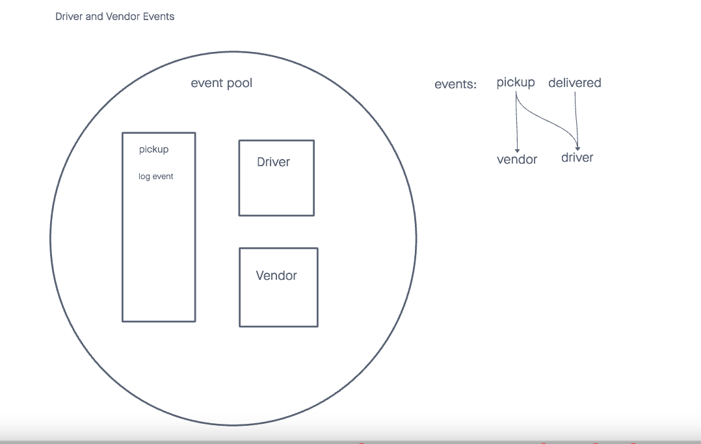

# LAB - Class 08

## Project: Auth API SERVER

### Author: Malik Sadiki-Torres

### Problem Domain

Debug the server and get routes working
### Links and Resources

- [GitHub Actions ci/cd](https://github.com/MalikTorres/auth-api)
- [back-end server](https://bearer-auth-r674.onrender.com)

### Collaborators
I referenced Ryan Gallaways demo and implemented test with the help of AI

### Setup

Install required dependecies and create postgre database

#### `.env` requirements (where applicable)

No requirements

#### How to initialize/run your application (where applicable)

clone repo, `npm i -y`, `npm eslint`

#### Tests

to run tests, after running `npm i`, run the command `npm test`

#### UML

